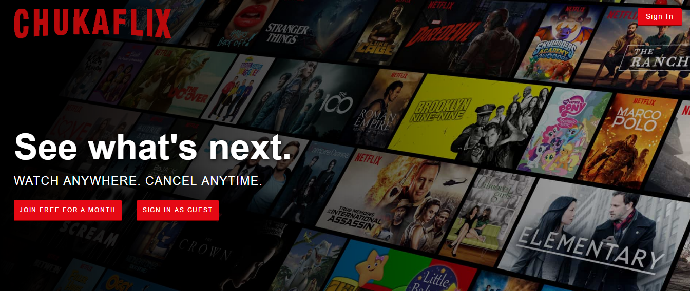
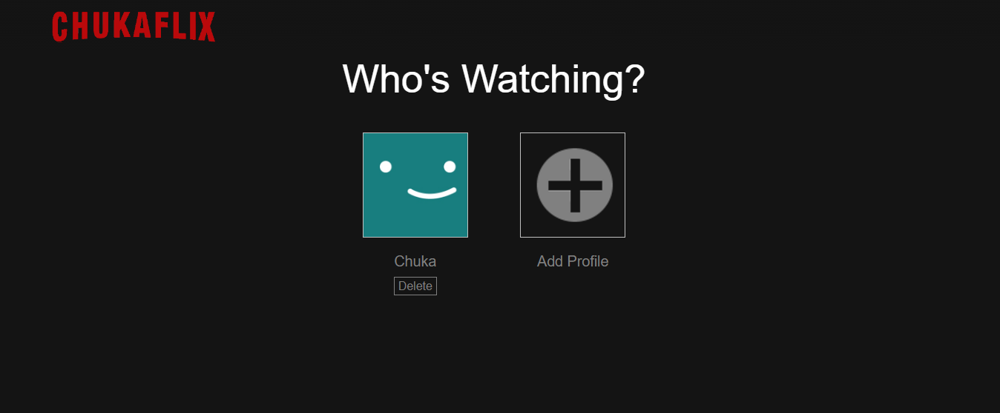
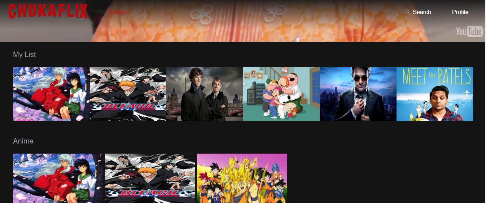
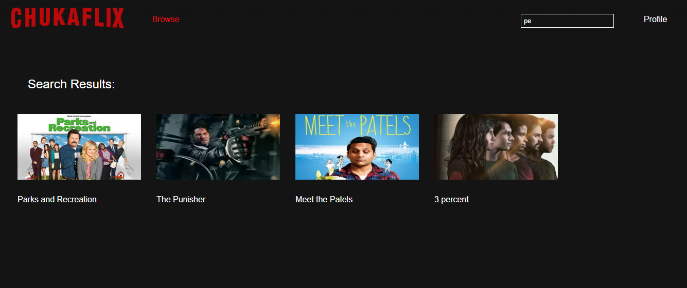
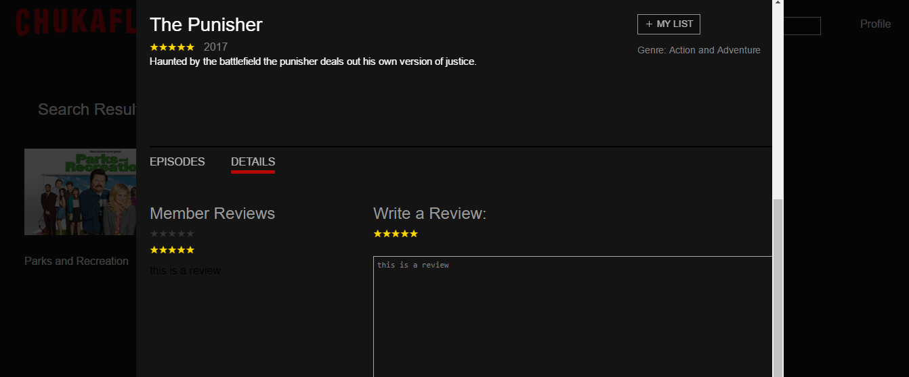

# ChukaFlix

Full-stack web application inspired by Netflix. Written with Ruby on Rails, it has a PostgresSQL database and incorporates JavaScript and React for the frontend.

## How to Enjoy

You can login or use a guest account

### Profile

You can make or pick a profile. Every account can have up to five personalized profiles.

### Browse

Browse and enjoy series and videos.

You can also add your favorite movies to your own personal list. Your list is specific to your profile.

### Search

You can search through all the series selections for quicker access to your favorite shows.

### Review

You can rate and review any serie you want to.

### Future goals

* Add a continue watching feature so any user on ChukaFlix can pick up where they left off.

* Notifying site users of new seasons of series on their lists.

* Playing the next episode at the end of one.
